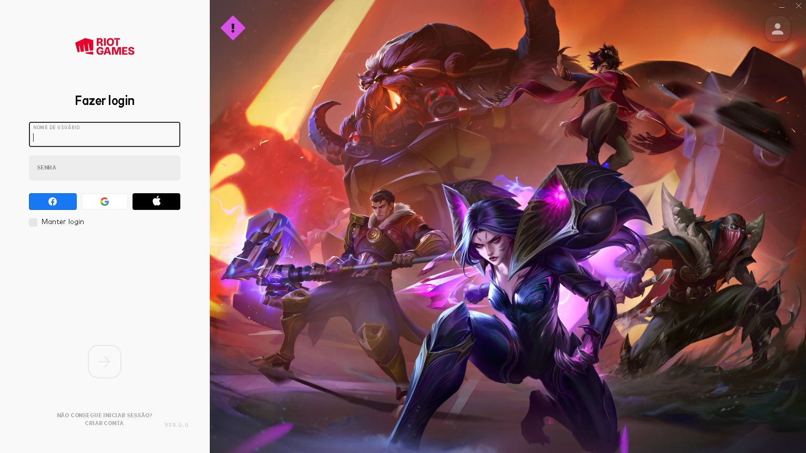

# League of Legend login page

> League of Legends project, login screen with TS.
> Live demo [_Here_](vercel).

## Table of Contents

- [League of Legend login page](#league-of-legend-login-page)
  - [Table of Contents](#table-of-contents)
  - [General Information](#general-information)
  - [Technologies Used](#technologies-used)
  - [Features](#features)
  - [Screenshots](#screenshots)
  - [Setup](#setup)
  - [Project Status](#project-status)
  - [Room for Improvement](#room-for-improvement)
  - [Acknowledgements](#acknowledgements)
  - [Contact](#contact)

## General Information

- The idea of this project is make a league of legends login screen the same as the original version, maybe with more details.

## Technologies Used

- React - lastest
- TypeScript - lastest
- ChakraUI - lastest
- React Router Dom - lastest

## Features

- Login Page
- Form Component
- Video Component

## Screenshots

## Setup

Basically you need to access the vercel link to see it, nothing else.

## Project Status

Project is: _in progress_

## Room for Improvement

To do:

- Register page
- Link the project with the riot api
- Dashboard page

## Acknowledgements

- This project was inspired by the league of legends login page (it's a copy for training my developments skills)

## Contact

Created by [@devBraz](https://www.linkedin.com/in/charlesbraz/) - feel free to contact me!
